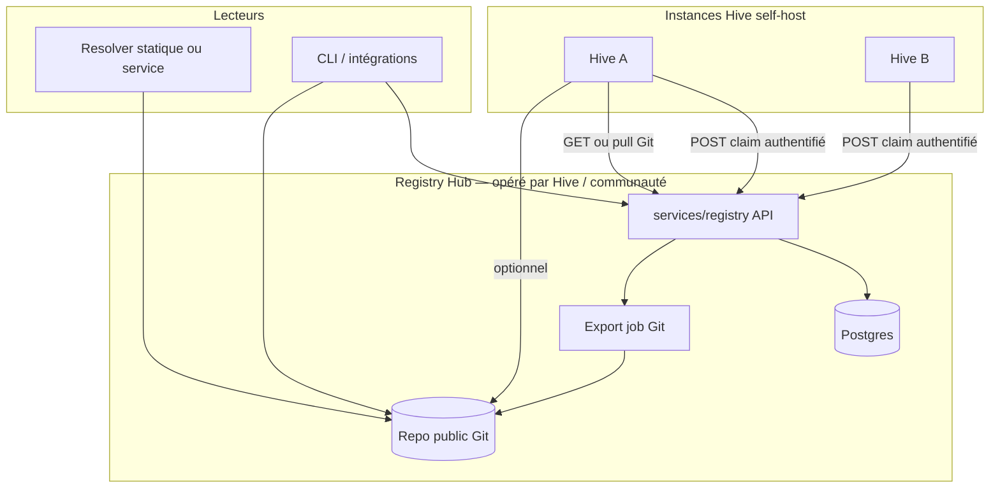

# Plan — Hive Global Registry (API centrale + miroir Git + résolveurs)

> **Objectif** : annuaire public de handles stables (Agent Card / mesh), **écriture sécurisée** depuis les instances Hive, **lecture** scalable (API + Git), **unicité** garantie sans donner de clés Git aux self-hosters.  
> **Statut** : plan produit / architecture — implémentation par phases.  
> **Alignement** : [`CDC_REGISTRY_PUBLIC.md`](./CDC_REGISTRY_PUBLIC.md), [`openapi/registry-v1.yaml`](./openapi/registry-v1.yaml), [`schemas/hive-registry-record-v1.schema.json`](./schemas/hive-registry-record-v1.schema.json), service [`services/registry/`](../services/registry/).

---

## 1. Problème et principe directeur

| Exigence | Approche |
|----------|----------|
| Transparence / audit | **Git** = historique append-only des records admis (fichiers JSON + commits signés ou CI vérifiable). |
| Unicité des noms | **Postgres** (ou DB du registry) avec contrainte **`UNIQUE(handle)`** — pas de course sur Git. |
| Self-hosters n’ont pas les clés du repo | **Écriture uniquement** via **HTTPS** vers le **Registry Hub** (Bearer par instance, mTLS, ou JWT émis à l’enregistrement). |
| Instances Hive lisent le catalogue | **Pull Git** (raw / shallow) **ou** **`GET /v1/records`** — cache **local** (mémoire / Redis **de l’instance**). |
| Namespaces réservés par instance | Handle canonique **`{tenantId}/{slug}`** (ou équivalent) ; le Hub lie `tenantId` ↔ identité d’instance. |
| Résolveur « qui lit Git » | Service léger ou **pages statiques** + `index.json` / arbre `records/**` régénéré à chaque export. |

**Règle d’or** : Git ne remplace pas la DB pour les décisions concurrentielles ; Git **reflète** l’état après validation.

---

## 2. Architecture logique

---

## 3. Modèle de nommage (namespaces)

### 3.1 Format de handle recommandé

- **`{tenantKey}/{slug}`**  
  - `tenantKey` : identifiant stable d’**instance enregistrée** (ex. ULID, ou hash canonique de l’`AUTH_URL` / origin après normalisation).  
  - `slug` : `a-z0-9-` borné (longueur max définie), unique **sous** ce tenant.

### 3.2 Règles Hub

1. À l’**enregistrement d’instance**, le Hub délivre `tenantKey` + **secret** ou **certificat client** / token rotatif.  
2. Tout `POST` de record : le `handle` **doit** commencer par `tenantKey + "/"` ; sinon **403** `policy_denied` (équivalent conceptuel à `REGISTRY_POST_HANDLE_PREFIX_ALLOWLIST` par tenant).  
3. **Global** : `UNIQUE(handle)` sur la table des records — impossible de prendre un handle déjà réservé par un autre tenant.  
4. Option : handles **globaux** réservés (`admin`, `api`, …) listés côté Hub.

### 3.3 Preuve de contrôle (recommandé)

- Exiger que `agentCardUrl` soit **joignable** et optionnellement qu’un **challenge** (fichier well-known, ou signature Ed25519 du record avec clé annoncée sur la Agent Card) soit satisfait avant premier enregistrement du slug sous le tenant.  
- Réutiliser les idées **P5** / `proof` du schéma existant et `REGISTRY_VERIFY_ED25519_PROOF` quand activé.

---

## 4. Chemins de données

### 4.1 Écriture (claim / mise à jour)

1. L’utilisateur crée ou renomme un agent **dans son UI Hive** ; l’instance appelle le Hub :  
   `POST /v1/records` (ou endpoint dédié `POST /v1/instances/{tenantKey}/records` — même sémantique, auth scopée).  
2. Le Hub : authentifie l’instance → vérifie préfixe handle → valide **Ajv** (`hive-registry-record-v1`) → vérifie preuve / readiness si activé → **INSERT/UPDATE** en DB.  
3. En cas de conflit sur handle global → **409**.  
4. **Transaction** : après commit DB, mettre en file une tâche **export Git** (asynchrone).

### 4.2 Export Git (seul writer Git)

- **Compte machine** unique (GitHub App / bot) avec droit push sur le repo public.  
- Job (cron ou queue) :  
  - dump des records depuis DB (ou delta depuis dernier `export_seq`) ;  
  - écrit `records/{handle-normalisé}.json` (échapper `/` en sous-dossiers par tenant si besoin) ;  
  - commit message : `registry: upsert {handle} @ {commit_sha_short}` ;  
  - tag optionnel `snapshot-YYYYMMDD` pour résolveurs statiques.  
- **Signature** : optionnel — commit signé (SSH/GPG) ou **catalogProof** déjà prévu côté API (`REGISTRY_CATALOG_SIGNING_KEY_HEX`) publié dans le repo (`catalog.json` + sig).

### 4.3 Lecture côté instance Hive

| Mode | Usage |
|------|--------|
| **A — API** | `GET /v1/records/{handle}` / `GET /v1/records` avec rate limit ; ETag pour cache. |
| **B — Git** | `git pull --depth 1` ou fetch `raw` + parsing `index.json` généré par l’export ; index **local** dans Redis/mémoire de l’instance (TTL ou invalidation par polling). |
| **Hybride** | Préférer API pour **disponibilité immédiate** après claim ; Git pour **audit** ou mode dégradé si API down. |

### 4.4 Resolver public « lit Git »

- **Statique** : GitHub Pages / object storage servant `index.json` (liste handles + URL du record) + fichiers record ; pas de DB.  
- **Ou** petit worker : `git pull` → sert `GET /resolve/{handle}` en mémoire ; redéploiement à chaque push webhook.  
- Le **catalogue signé** permet aux clients de vérifier l’intégrité sans faire confiance au seul hébergeur du JSON.

---

## 5. Sécurité (synthèse)

| Risque | Mesure |
|--------|--------|
| Fuite de secret d’instance | Tokens **par instance**, rotation, révocation ; jamais de clé Git partagée. |
| Squatting global | `UNIQUE(handle)` + préfixe tenant obligatoire. |
| Faux `agentCardUrl` | Challenge HTTP / preuve Ed25519 + `REGISTRY_PUBLISH_READINESS` si activé. |
| Abus d’écriture | Rate limit write (Redis côté **Hub**), pas sur le Redis des instances. |
| Abus de lecture / énumération | Rate limit read ; option `REGISTRY_CATALOG_SECRET` ; limiter `/v1/resolve`. |
| Supply chain Git | Branch protection, CI obligatoire sur le repo (voir § 8). |

---

## 6. Temps réel et cohérence

- **« Nom pris ? » au moment du claim** : réponse du **Hub** sur la DB — immédiat.  
- **Cache sur l’instance** : rafraîchissement par **polling** (ex. 30–120 s) ou **SSE/WebSocket sortant** depuis le Hub (connexion initiée par l’instance — compatible NAT).  
- **Git** : latence d’export (secondes à minutes) acceptable pour l’audit ; pas pour la décision d’unicité.

---

## 7. Phases d’implémentation

### Phase 0 — Socle (déjà largement présent)

- Déployer `services/registry` avec Postgres, TLS, rate limits, schéma v1.  
- Documenter l’URL du Hub pour les instances.

### Phase 1 — Tenants instances

- Table `registry_tenants` : `tenant_key`, `origin` (AUTH_URL canonique), `created_at`, statut.  
- Endpoint **enregistrement** : émet `REGISTRY_INSTANCE_TOKEN` (ou workflow manuel pour v1).  
- Middleware auth : remplace ou complète le Bearer global par **token scopé** `tenant_key` + enforcement préfixe handle.

### Phase 2 — Intégration Hive (app)

- Settings / agent : champ **« handle public »** sous `tenantKey/...` (slug validé côté client).  
- Au save : appel Hub `POST /v1/records` ou validate puis POST ; afficher erreurs **409** / **403** / **422**.  
- Config env : `HIVE_PUBLIC_REGISTRY_URL`, `HIVE_PUBLIC_REGISTRY_TOKEN` (secret instance).

### Phase 3 — Export Git

- Job Node ou Action déployée **côté Hub** : DB → fichiers → commit push.  
- Repo public + README « comment lire l’index ».  
- Génération `catalog.json` + option `catalogProof` alignée sur clés existantes.

### Phase 4 — Resolver

- Hébergement statique ou micro-service lecture seule sur Git.  
- Lien depuis docs Hive + `/.well-known` ou doc marketplace.

### Phase 5 — Durcissement

- Preuve Ed25519 obligatoire pour certains tenants ; PDP externe (`REGISTRY_PDP_HTTP_URL`) ; révocation documentée ; SLA / monitoring Hub.

---

## 8. CI sur le repo Git (rôle distinct des PR code Hive)

- **Sur le repo données** (optionnel) : workflow qui vérifie que chaque fichier respecte le JSON Schema **sans** être la source d’écriture des contributeurs lambdas (les écritures viennent du bot du Hub).  
- La CI sert à **détecter corruption / push malveillant** si compte bot compromis — alerte + revert.  
- Les **PR** sur le dépôt **Hive** (code) restent pour améliorer le produit, pas pour entrer les handles à la main (sauf procédure d’urgence opérateur documentée).

---

## 9. Livrables documentaires / ops

| Livrable | Contenu |
|----------|---------|
| Runbook opérateur Hub | rotation secrets, quota, ban tenant, restauration DB |
| Runbook instance | config env, troubleshooting 401/409, mode sans Hub (local only) |
| Contrat SLA (si hébergé) | disponibilité API vs Git mirror |
| Politique de noms | longueur slug, caractères, liste réservée |

---

## 10. Hors périmètre (rappel)

- Paiement / enchères de noms (évolution produit séparée).  
- DHT globale (voir roadmap mesh existante).  
- Remplacement du DNS public Internet — le Hub est un **annuaire volontaire** pour l’écosystème Hive.

---

## 11. Décisions à trancher (backlog décisionnel)

1. **Identité du tenant** : ULID dédié vs hash de `AUTH_URL` (implications migration si l’URL change).  
2. **Un seul Hub** « officiel » vs fédération de Hubs avec sync P4 déjà documentée.  
3. **Export Git** : fréquence fixe vs immédiat après chaque écriture (charge vs fraîcheur lecture Git).  
4. **Handles lisibles** : autoriser un alias marketing `slug` global réservé payant ou non.

---

## 12. Miroir Git (template + dépôt public)

- **Monorepo** : [`contrib/hive-public-registry/`](../contrib/hive-public-registry/)  
- **GitHub** : [Takinggg/hive-public-registry](https://github.com/Takinggg/hive-public-registry)  

**Export (Phase 3 — script livré)** : depuis `services/registry` avec `REGISTRY_DATABASE_URL` :

`npm run export-records` → écrit sous `registry-export/records/` (ou passer le chemin du dossier `records/` du clone `hive-public-registry`). Ensuite `git add` + `commit` + `push` sur le miroir (ou workflow dédié).

---

*Document vivant — Phase 1 (instance auth + admin API) implémentée dans `services/registry` ; export Git à brancher ensuite.*
