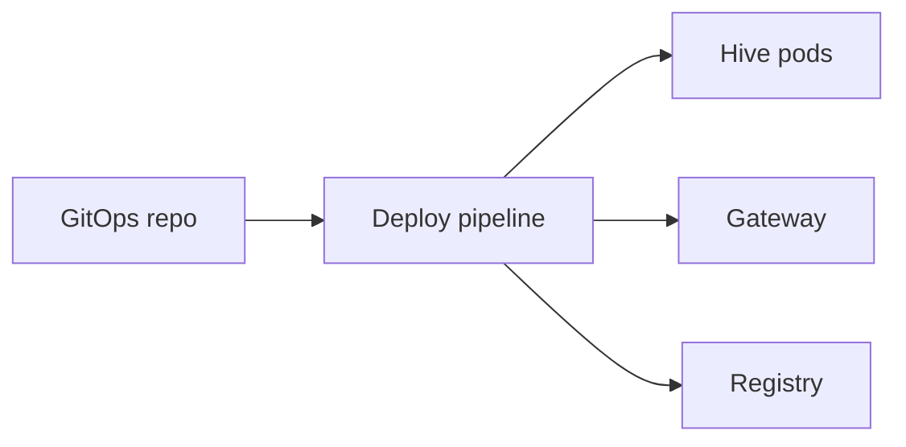

# Centralized policy — distribution, versioning, audit

**Status:** architecture note (MVP vs later).  
**Tracking:** GitHub issue [#5](https://github.com/Takinggg/Hive/issues/5), [`MESH_WORLD_NETWORK_EPIC.md`](./MESH_WORLD_NETWORK_EPIC.md).

This document defines how an **organization** can treat **policy** (mesh, registry, gateway) as a **single evolving artifact** with traceability. It does not mandate a vendor product; it maps to patterns already present in the repo.

---

## 1. Goals

- **One place to decide** what peers, methods, rate limits, or publish rules are “current” for a fleet (or tier).
- **Consumers** (Hive app, `services/gateway`, `services/registry`, workers) apply policy with **defined TTL / refresh** and **rollback**.
- **Audit**: who published, which version, diff-friendly artifacts.

---

## 2. MVP (fits current repo)

| Source of truth | Mechanism | Consumers |
|-----------------|-----------|-----------|
| **Federation roster** | Static env `MESH_FEDERATION_PEERS` + optional **signed manifest** URL (`MESH_FEDERATION_PEERS_MANIFEST_*`) | Hive federation directory, proxy, inbound JWT checks |
| **Registry writes** | PDP + publish readiness (`registry-pdp-http`, `registry-publish-readiness`, tenant rules) | Registry `PUT` / catalog |
| **Public A2A** | Env allowlists, rate limits, API keys (`A2A_*`, `PUBLIC_*`) | Hive JSON-RPC |
| **Gateway** | Env (`GATEWAY_*`, upstream secret alignment with `MESH_GATEWAY_INBOUND_SECRET`) | `services/gateway` |

**Operational pattern:** store env in **GitOps** (Helm values, sealed secrets) = implicit **versioning** (commit SHA). **Rollback** = revert commit + redeploy.

**Threats:** compromised CI/CD or values repo → treat like **key compromise**; rotate secrets, review audit logs.

---

## 3. Later: centralized bundle (optional)

- **Artifact:** signed JSON or **OPA bundle** (policy.rego + data) **or** small **CRD**-like manifest; distributed via HTTPS from an **internal** policy service.
- **Flow:** publisher signs → CDN/object storage → consumers **fetch + verify** → apply in-memory with **max-age** + **forced refresh** endpoint for incidents.
- **Audit:** append-only log of `(version, publisher_id, hash, timestamp)` in SIEM or Postgres.

**Split-brain:** consumers MUST define **precedence** (e.g. local emergency override > central > default).

**Stale policy:** shorter TTL for security-critical rules; longer for catalog hints.

---

## 4. Code map (starting points)

| Area | Path / doc |
|------|------------|
| Federation manifest | [`MESH_FEDERATION_RUNBOOK.md`](./MESH_FEDERATION_RUNBOOK.md), `app` mesh federation libs |
| Registry PDP | `services/registry/src/registry-pdp-http.mjs` |
| Publish readiness | `services/registry/src/registry-publish-readiness.mjs` |
| Public mesh bootstrap | `app/src/lib/mesh-public-bootstrap.ts`, `GET /.well-known/hive-mesh.json` |
| mTLS / transport trust | [`MESH_MTLS.md`](./MESH_MTLS.md) |
| Registry product spec | [`CDC_REGISTRY_PUBLIC.md`](./CDC_REGISTRY_PUBLIC.md) |

---

## 5. Relation to federation runbook

Operational pairing steps are unchanged; this doc adds **how** a large org might **layer** a policy service **above** env-only fleets. See **§7** in [`MESH_FEDERATION_RUNBOOK.md`](./MESH_FEDERATION_RUNBOOK.md).
