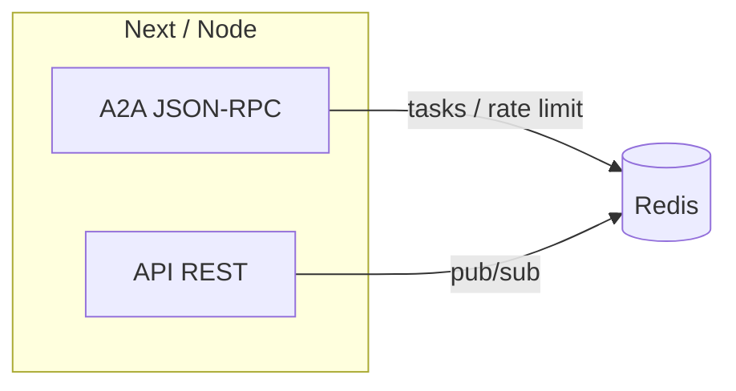

# Mesh v1 — Redis event bus (same OS / same tenant)

Short document for the **"transport" Phase** at the Hive scale when everything runs **on the same OS** (a VM, a host, a container): no NATS required to bootstrap v1.

---

## Role

- **A2A** (`POST /api/a2a/jsonrpc`, `/.well-known/agent-card.json`): request/response conversation and persisted tasks (Redis), caller identity = rule documented in `GET /api/a2a/status` and [`A2A_INTEGRATION.md`](./A2A_INTEGRATION.md).
- **Redis pub/sub** (existing channels in `app/src/lib/redis.ts`): **best-effort**, fire-and-forget to signal state changes (agents, system) to subscribers on the same Redis instance.

---

## Current channels (code)

| Channel | Indicative usage |
|---------|------------------|
| `hive:agent:status` | Agent status broadcast |
| `hive:agent:logs` | Agent log stream |
| `hive:system:events` | Platform events |

**Strict contract on emission**: payloads go through **Zod** schemas in `app/src/lib/mesh-events.ts`; on failure, **no** `PUBLISH` is executed and a `mesh.redis.publish_invalid_payload` log is emitted (subscribers never see off-contract JSON from these helpers).

Each published message includes **`meshMeta`**: `{ v: 1, producer: "hive-core", eventId: <uuid>, correlationId? }`. If **`MESH_BUS_HMAC_SECRET`** (env, ≥32 characters) is set, a **`meshSig`** field (hex 64) authenticates the pair (channel + core + `meshMeta`) — see `meshHmacHex` / `verifyAgentStatusHmac` / `verifySystemEventHmac` in `app/src/lib/mesh-envelope.ts`. Agent routes propagate `X-Request-Id` / `X-Correlation-Id` / `traceparent` to `meshMeta.correlationId` when present.

Delivery promise: **best-effort** (no application-level ack; if Redis is down, the event is lost unless retry logic exists elsewhere).

**Production**: prefer **TLS** to Redis (`rediss://` URL) and **ACL**-restricted users so the bus and rate-limit keys are not readable on the wire or from unrelated workloads.

**If Redis is unreachable**: `publishAgentStatus` / `publishSystemEvent` log `mesh.redis.publish_failed` (warn) and **do not fail** the API request — explicit degradation, no silent hang. The **ioredis** client uses `maxRetriesPerRequest: 3` and `lazyConnect: true` (`app/src/lib/redis.ts`).

---

## Timeouts & retries (v1) — reference

| Flow | v1 behavior | Client-side idempotence |
|------|-------------|------------------------|
| **Redis connection** | Up to 3 attempts per command (`maxRetriesPerRequest`) then error. | Automatic reconnect on the next call. |
| **API rate limit** (`checkRateLimit*`) | Redis failure → **deny** (no abuse opening). | Wait for `Retry-After` / backoff. |
| **Mesh pub/sub** | Failure → log + no publish; no automatic application-level retry. | Replay the business action if needed (out of automatic scope). |
| **A2A JSON-RPC** | Timeouts / errors handled by the Next handler + SDK; see `mesh.a2a.rpc.*` logs. | Same JSON-RPC `id` for correlation; **business idempotency keys** = V2 topic for WAN calls. |
| **Agent APIs** (start/stop/…) | Postgres + runtime; final state in `agents.status`. | A second `POST` on an already-reached state may return 400 — expected behavior. |

---

## Logical schema (v1)

For **agent-to-agent messages** with strong semantics (at-least-once, persistence until ack) **across sites or over the Internet**, see **[`MESH_V2_GLOBAL.md`](./MESH_V2_GLOBAL.md)** (WAN transport + trust). The v1 remains **best-effort** on local pub/sub.

---

## Correlation with A2A

- JSON-RPC requests carry a JSON-RPC `id`: to be used as a **correlation id** in the logs (`mesh.a2a.rpc.request` in the app).
- Protocol-side identity follows `User.userName` (Hive user UUID, email, or `hive-internal` for the machine token) — aligned with audit and per-peer rate limiting.

---

## Reasonable v1 limits (indicative)

- Order of magnitude: tens of agents, hundreds of events/second on a local Redis — beyond that, scale Redis and consider a dedicated bus.
