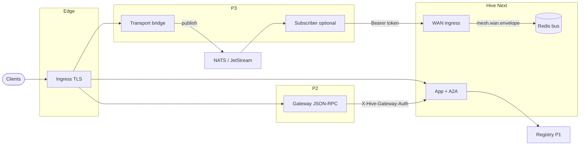

# Mesh WAN — déploiement complet (guide opérateur)

**Objectif :** une seule entrée pour enchaîner **P1 registry**, **P2 gateway**, **P3 transport-bridge** (+ subscriber optionnel), **NATS/JetStream**, et **Hive** (ingress WAN, Redis, fédération). Ce document **ne remplace pas** les guides détaillés : il les ordonne et pointe vers eux.

**Statut :** services de référence dans le dépôt ; **vous** opérez l’infra (DNS, TLS, NATS, sauvegardes).

---

## 1. Architecture logique



- **Gateway** : proxy JSON-RPC vers Hive (secret partagé `MESH_GATEWAY_INBOUND_SECRET` ↔ `GATEWAY_UPSTREAM_AUTH_SECRET`).
- **Bridge** : `POST /v1/publish` → NATS (`BRIDGE_INTERNAL_SECRET` + enveloppe **wan-envelope-v1**).
- **Subscriber** : consomme NATS → reposte vers **`HIVE_WAN_INGEST_URL`** avec **`HIVE_WAN_INGEST_TOKEN`** (= **`HIVE_INTERNAL_TOKEN`** sur Hive).
- **Registry** : annuaire HTTP (Postgres, secrets d’écriture séparés).

---

## 2. Ordre de déploiement recommandé (Kubernetes)

1. **Postgres + Redis** (Hive) — voir [`PRODUCTION.md`](./PRODUCTION.md), [`SERVER_INSTALL.md`](./SERVER_INSTALL.md).
2. **NATS** avec JetStream si vous utilisez `BRIDGE_NATS_MODE=jetstream` — créer le stream (ex. **`HIVE_MESH_WAN`**, sujet **`hive.mesh.wan`**) : [`deploy/nats-jetstream-hive-mesh-wan.example.md`](./deploy/nats-jetstream-hive-mesh-wan.example.md).
3. **Hive** (image `app/Dockerfile`) : migrations, `HIVE_INTERNAL_TOKEN`, `MESH_GATEWAY_INBOUND_SECRET` si gateway utilisé.
4. **Registry** (Helm [`deploy/helm/hive-registry`](../deploy/helm/hive-registry/README.md)) : Secret DB + `REGISTRY_WRITE_SECRET`, etc.
5. **Gateway** (Helm [`deploy/helm/hive-mesh-gateway`](../deploy/helm/hive-mesh-gateway/README.md)) : `gateway.upstreamBase` vers Hive, secret aligné sur Hive.
6. **Transport bridge** (Helm [`deploy/helm/hive-transport-bridge`](../deploy/helm/hive-transport-bridge/README.md)) : `bridge.natsUrl`, `bridge.internalSecret`, Ingress HTTP optionnel, **NATS TLS** optionnel (`bridge.natsTls`).
7. **Subscriber** (même chart, `subscriber.enabled: true`) : `hiveWanIngestUrl`, token depuis Secret.

**Alternative — un seul release Helm :** chart umbrella [`deploy/helm/hive-planetary`](../deploy/helm/hive-planetary/README.md). Exécuter `helm dependency build` dans ce dossier, puis passer les valeurs sous les clés `hive-registry`, `hive-mesh-gateway`, `hive-transport-bridge`. Désactiver un sous-chart : `registry.enabled=false`, `gateway.enabled=false`, ou `transportBridge.enabled=false`.

**Index des charts :** [`deploy/helm/README.md`](../deploy/helm/README.md).

---

## 3. Développement local (Docker Compose)

À la racine du dépôt :

```bash
docker compose up -d --build
```

- **NATS** : JetStream activé (`-js`) ; le bridge par défaut est en **`core`** (`PLANETARY_BRIDGE_NATS_MODE`) — pas de stream obligatoire.
- Pour **JetStream** en local : passer `PLANETARY_BRIDGE_NATS_MODE=jetstream` et créer le stream (CLI ou `nats-box`), voir [MESH_PLANETARY_DEV_STACK.md](./MESH_PLANETARY_DEV_STACK.md).
- **Secret bridge** : définir `PLANETARY_BRIDGE_INTERNAL_SECRET` (≥ 32 caractères) ou utiliser la valeur par défaut **uniquement en lab** (voir `docker-compose.yml`).

Détails : [`MESH_PLANETARY_DEV_STACK.md`](./MESH_PLANETARY_DEV_STACK.md).

---

## 4. Secrets et alignements (récapitulatif)

| Secret / variable | Où | Rôle |
|-------------------|-----|------|
| `HIVE_INTERNAL_TOKEN` | Hive | M2M ; **subscriber** `HIVE_WAN_INGEST_TOKEN` doit correspondre. |
| `MESH_GATEWAY_INBOUND_SECRET` | Hive | Auth entrante gateway → Hive. |
| `GATEWAY_UPSTREAM_AUTH_SECRET` | Gateway | Même valeur que ci-dessus (Bearer vers Hive). |
| `BRIDGE_INTERNAL_SECRET` | Bridge | `Authorization: Bearer` sur `POST /v1/publish`. |
| `REGISTRY_WRITE_SECRET` / DB URL | Registry | Écriture catalogue ; voir `services/registry/README.md`. |

Ne **réutilisez pas** un seul secret pour tout : séparez au minimum **bridge**, **gateway**, **registry write**, **Hive internal**.

---

## 5. TLS et réseau

- **HTTP** : terminaison TLS à l’**Ingress** (registry, bridge, gateway selon charts) — [`edge-tls-mesh-services.md`](./deploy/edge-tls-mesh-services.md), [`MESH_MTLS.md`](./MESH_MTLS.md).
- **NATS** : `BRIDGE_NATS_TLS*` / Helm `natsTls` — [`nats-jetstream-hive-mesh-wan.example.md`](./deploy/nats-jetstream-hive-mesh-wan.example.md) § TLS.
- **IP client** : `HIVE_CLIENT_IP_SOURCE` derrière proxy — [`PRODUCTION.md`](./PRODUCTION.md) §4.1.

---

## 6. Vérifications (qualité / prod)

| Vérification | Où |
|--------------|-----|
| Santé stubs HTTP | `node scripts/planetary-smoke.mjs` (URLs configurables) |
| Bridge → NATS | `npm run smoke:p3-nats` dans `services/transport-bridge` ; **CI** `planetary-stubs` |
| Exemples Kubernetes | `deploy/kubernetes/*.example.yaml` + Job/CronJob |
| Staging A → B | [`deploy/p3-multi-region-synthetic-check.md`](./deploy/p3-multi-region-synthetic-check.md) |
| Multi-site NATS (lab) | [`deploy/p3-jetstream-multi-site-lab.md`](./deploy/p3-jetstream-multi-site-lab.md) |
| SLO multi-région | [`observability/MULTI_REGION_SLO_RUNBOOK.md`](./observability/MULTI_REGION_SLO_RUNBOOK.md) |

---

## 7. Limites assumées (non couvert par ce dépôt)

- **Passerelle qui parle NATS en natif** : hors scope ; le design repo = HTTP → bridge → NATS ([`MESH_PLANETARY_P3_TRANSPORT.md`](./MESH_PLANETARY_P3_TRANSPORT.md)).
- **Réseau mondial unique opéré par Hive** : non ; vous opérez vos sites ([`MESH_WORLD_NETWORK_EPIC.md`](./MESH_WORLD_NETWORK_EPIC.md)).
- **DHT / stockage registry** : hints et nœud lab ; le registry canonique reste **HTTP P1**.

---

## 8. Références rapides

| Sujet | Document |
|--------|-----------|
| ADR P3 transport | [`MESH_PLANETARY_P3_TRANSPORT.md`](./MESH_PLANETARY_P3_TRANSPORT.md) |
| Rollout / feature flags | [`MESH_ROLLOUT_PLAYBOOK.md`](./MESH_ROLLOUT_PLAYBOOK.md) |
| Fédération JWT / IP | [`MESH_FEDERATION_RUNBOOK.md`](./MESH_FEDERATION_RUNBOOK.md) |
| Redis bus | [`MESH_V1_REDIS_BUS.md`](./MESH_V1_REDIS_BUS.md) |
| OpenAPI bridge | [`openapi/transport-bridge-v1.yaml`](./openapi/transport-bridge-v1.yaml) |
| Schéma enveloppe | [`schemas/wan-envelope-v1.schema.json`](./schemas/wan-envelope-v1.schema.json) |
| Epic « world network » | [`MESH_WORLD_NETWORK_EPIC.md`](./MESH_WORLD_NETWORK_EPIC.md) |

---

*Dernière mise à jour : guide d’intégration opérateur ; les versions d’images et les valeurs Helm par défaut restent celles des fichiers du dépôt.*
